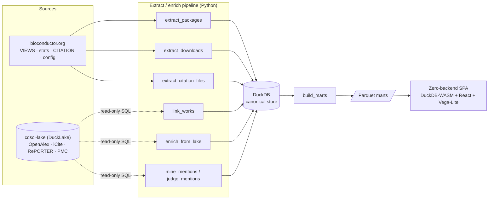

# Bioconductor Intelligence Platform

**Research-intelligence and impact analytics for the [Bioconductor](https://bioconductor.org)
ecosystem** — packages, downloads, publications, citations, and grant linkages, computed into a
zero-backend dashboard you can explore in your browser.

### 🔗 [**Live dashboard → seandavi.github.io/bioc-intelligence**](https://seandavi.github.io/bioc-intelligence/)

[](https://github.com/seandavi/bioc-intelligence/actions/workflows/ci.yml)
[](https://github.com/seandavi/bioc-intelligence/actions/workflows/frontend-ci.yml)
[](https://github.com/seandavi/bioc-intelligence/actions/workflows/deploy-pages.yml)

---

## Why

Bioconductor is one of the largest open-source ecosystems in computational biology, but its
*impact* is scattered across release manifests, download logs, the literature, and grant databases.
This platform pulls those threads together to serve three use cases:

- **Grant submission** — defensible impact evidence for renewals and new proposals (which packages a
  grant supported, how widely they're used and cited).
- **Public visibility** — a dynamic dashboard of ecosystem activity and impact.
- **Metaresearch** — Bioconductor itself as an object of study.

## Features

The dashboard is a **zero-backend single-page app**: it queries prebuilt Parquet "marts" directly in
your browser with [DuckDB-WASM](https://duckdb.org/docs/api/wasm/overview.html) — no server, no API.

| View | What it shows |
|------|---------------|
| **By the Numbers** | Headline ecosystem + impact stats, computed live: packages, maintainers, biocViews terms; linked publications, **total citations**, **median RCR** (with p10–p90 spread), NIH grants; a citations-by-year chart. |
| **Explorer** | All **3,810 packages** in a searchable, sortable, faceted table — biocViews chips, maintainers, links, describing DOI, and a per-package detail panel. |
| **biocViews** | Browse the **642-term** controlled vocabulary that classifies every package, with package counts. |
| **Impact leaderboard** | Rank packages by **median RCR**, total citations, linked publications, or grants. |
| **Grants** | NIH grant → supported-package **attribution** (the renewal-narrative payload), with **CSV export**. |
| **Growth** | Current-release ecosystem snapshot (release-over-release history is on the roadmap). |

Every metric carries an **(?) info marker** explaining it in a sentence — RCR, the distinct-IP usage
proxy, and so on — and the app shows **honest "pending" states** rather than fake zeros where a data
source is currently unavailable.

## Architecture & data flow

Framework-free extract modules write into a single canonical **DuckDB** file; `build_marts` exports
**Parquet** marts that the SPA reads. Shared bibliometric corpora are read **read-only** from the
sibling [`cdsci-lake`](https://github.com/seandavi/cdsci-lake) data lake — not re-fetched from APIs.



**Why this shape?** The local store is a plain DuckDB file (single-writer, batch-refresh) — simple to
copy and reason about. The lake is the *upstream* shared substrate; enrichment is cross-catalog SQL
(`lake.openalex.works` joined to local tables), not an API client. Parquet marts are the only thing
the frontend couples to. See [`bioc-intelligence-spec.md`](bioc-intelligence-spec.md) for the full
design and [`docs/frontend-spec.md`](docs/frontend-spec.md) for the UI.

### Data sources

| Domain | Source | Via |
|--------|--------|-----|
| Package metadata / versions | `bioconductor.org` VIEWS (all 4 repos) + `config.yaml` | HTTP |
| Describing publication | DESCRIPTION DOI + per-package **CITATION** page | HTTP |
| Citing literature / cited-by | OpenAlex (`works`, `work_references`) | cdsci-lake |
| Field-normalized impact (RCR) | NIH iCite | cdsci-lake |
| Grants | NIH RePORTER | cdsci-lake |
| Full-text mentions | Europe PMC / PMC (`pmc.passages`) | cdsci-lake |
| Download stats | `bioconductor.org` stats tabs | HTTP *(see caveats)* |

## Quickstart

### Pipeline (Python, [uv](https://docs.astral.sh/uv/))

```bash
uv venv && uv pip install -e '.[dev]'

uv run biocintel init-db              # create the DuckDB store + schema
uv run biocintel extract-packages     # VIEWS → dim_package(_version), all 4 repos
uv run biocintel extract-citations    # CITATION pages → bridge_package_pub (authoritative)
uv run biocintel extract-downloads    # download stats → fact_download (currently skips; see caveats)
uv run biocintel build-marts          # derive mart_* → data/marts/*.parquet

uv run pytest                         # offline parser/aggregation tests
uv run ruff check src tests           # lint
```

Phase-2 enrichment reads the lake (needs the `cdsci-lake` client + credentials):

```bash
uv pip install -e ../cdsci-lake
CU_OPENALEX_LAKE_BACKEND=postgres uv run python -m biocintel.pipeline.link_works
CU_OPENALEX_LAKE_BACKEND=postgres uv run python -m biocintel.pipeline.enrich_from_lake
```

### Frontend (Vite + React + TypeScript)

```bash
cd frontend
npm install
bash scripts/sync-marts.sh   # copy ../data/marts/*.parquet → public/data + a snapshot manifest
npm run dev                  # local dev server
npm run build                # production build → dist/
```

The dashboard auto-deploys to GitHub Pages on every push to `main` that touches `frontend/`.

## Repository layout

```
src/biocintel/            # extract/enrich pipeline (framework-free modules)
  config · http · dcf · db · schema.sql
  pipeline/               # extract_packages, extract_downloads, extract_citation_files,
                          # link_works, enrich_from_lake, mine_mentions, judge_mentions, build_marts
  lake.py                 # attach cdsci-lake read-only for enrichment
frontend/                 # zero-backend SPA (DuckDB-WASM + React + Vega-Lite)
  src/db, src/pages, src/components
  public/data/            # bundled Parquet marts (a dated snapshot)
docs/frontend-spec.md     # UI design + opportunities
bioc-intelligence-spec.md # platform spec (source of truth)
CLAUDE.md                 # orientation for contributors / agents
```

## Caveats & known limitations

This is honest about what it does and doesn't yet cover:

- **Download stats are currently unavailable.** Bioconductor's stats `.tab` endpoints have been
  404ing since the BioC 3.23 site redesign, so the distinct-IP usage metric shows **pending**. The
  extractor logs-and-skips (per `BiocPkgTools` convention) and will populate when the endpoints
  return.
- **Linkage favors precision over recall.** Package→manuscript links come from DESCRIPTION DOIs and
  **CITATION files** (author-asserted, authoritative). Naive title-matching against OpenAlex is
  *deliberately not used* — many package names are common words (`muscle`, `gage`, `tuberculosis`),
  so it floods with false positives (empirically ~1,500 matches, mostly wrong). Consequently, some
  packages that *do* have a paper remain unlinked until they ship a DOI/CITATION; a precision-filtered
  title-candidate → LLM-judge path is on the roadmap.
- **Impact coverage is partial.** RCR and citation counts exist only for linked works present in
  iCite / OpenAlex. Cited-by edges (`fact_citation_edge`) and full-text mention mining are built but
  run on demand (the references table is ~1.3B rows), so the "citing works" surfaces are not yet
  populated at scale.
- **Release-over-release growth is limited** to the current release until per-package version history
  is backfilled from `git.bioconductor.org` tags.
- **The dashboard reflects a dated snapshot.** Marts are committed Parquet (see the `snapshot` stamp
  in the header), not live data. A refresh re-runs the pipeline and re-bundles the marts.
- **Enrichment requires the private `cdsci-lake`** (credentials via Google Secret Manager). The
  *public* dashboard ships only the derived marts — no credentials or raw lake access needed to view it.
- **Upstream accuracy applies.** Figures are only as good as OpenAlex / iCite / RePORTER / Bioconductor;
  a few landmark papers carry very high RCRs, and metadata gaps propagate.

## Roadmap

Planned and possible future work — precision-filtered title→judge linkage, cited-by edges and
full-text mention mining at scale, restoring download stats, git-tag version history for
release-over-release growth, cross-view navigation, and scheduled refresh — is tracked in
[**ROADMAP.md**](ROADMAP.md).

## Tech stack

DuckDB · Parquet · Python ([uv](https://docs.astral.sh/uv/), ruff, pytest) · React · TypeScript ·
Vite · Tailwind · [DuckDB-WASM](https://duckdb.org/docs/api/wasm/overview.html) · Vega-Lite ·
[TanStack Table](https://tanstack.com/table) · GitHub Actions + Pages.

## Acknowledgments

Built on data from [Bioconductor](https://bioconductor.org),
[OpenAlex](https://openalex.org), [NIH iCite](https://icite.od.nih.gov/),
[NIH RePORTER](https://reporter.nih.gov/), and [Europe PMC](https://europepmc.org/), sourced through
the [`cdsci-lake`](https://github.com/seandavi/cdsci-lake) research-data lake.

## License

[MIT](LICENSE)
